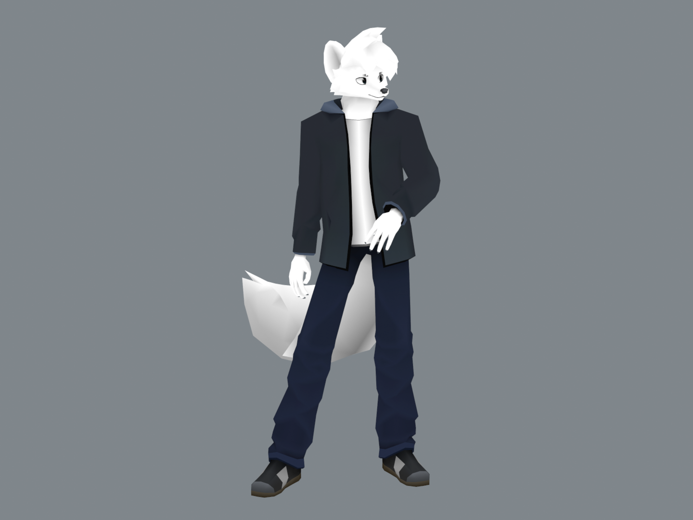

# vrcfox-haptics

Trev3d's vrcfox ("Simple Fox") VRChat avatar, adapted for [my head haptics project](https://github.com/gary600/introxr-headhaptics).

Trev3d's README follows:

---

# vrcfox
a minimalistic furry avatar for vrchat

## Get ⬇️

### [Use public test avatar >>>](https://vrchat.com/home/avatar/avtr_935bce4d-b613-4658-8f0c-057c62b4eb41)

### [Sketchfab preview >>>](https://sketchfab.com/3d-models/low-poly-fox-f46335a0a8064fb484712d2d228f3b14)

### [Download files >>>](https://github.com/cellomonster/vrcfox/releases/latest) 
(choose version and download 'source code' zip!)

## Strakacher's fork ⭐
A fork that comes with a body mesh, extra clothes meshes, and many other additional customization options! 
### [Fork repo >>>](https://github.com/strakacher21/vrcfox-2.3_body_and_cloth_edition)

## A request ⚠️
Given the license I can't legally stop you, but I'll still ask politely - please do not use this model for pornographic or suggestive content.

## Customization

The full project includes both a Blend file and a Unity project.

The blend file requires Blender 4.2 or later

The easiest way to customize the colors is with vertex painting rather than using a texture. This works well for solid colors but won't work for fancy patterns. Your avatar file size will stay tiny and quick to download without texture files. If you would rather use a texture, the model has a second set of UVs. You'll need to change each mesh's active UV layer to 'UVMap' and apply a texture yourself. You'll also want to erase all of the vertex colors as these will still appear on the default material in the Unity project!

A script to easily export the model to Unity is included in the Blender file. It is visible at the bottom of the window when you open the project. Clicking the '▶' button will export the model to Unity.

The Unity project contains an 'avatar setup base' prefab and two scenes for Quest and PC. Changes made to the prefab will propogate to both the PC and Quest verions of the avatar, while changes made to the Quest/PC scenes are platform specific. 

The Unity project also includes a script (attached to the avatar prefab) to easily customize facial expressions, player preferences, and facetracking features. You can disable some features to save on VRChat parameter budget or add your own blendshapes for expressions, body customization, clothing toggles, facetracking, etc.

## Attribution
- I'm using [hai-vr's av3-animator-as-code package](https://github.com/hai-vr/av3-animator-as-code) to set up animators
